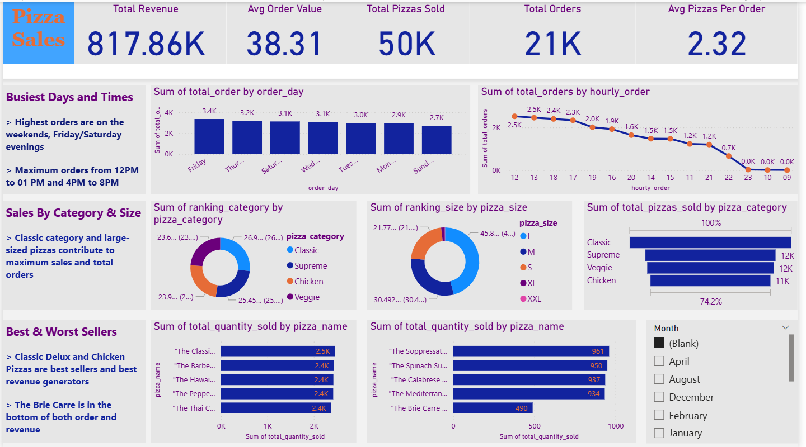

# 🍕 Pizza Sales Analysis Dashboard (SQL & Power BI)

## 📌 Project Overview
This project analyzes pizza sales data to uncover business insights related to revenue, customer ordering behavior, peak sales times, and product performance. The analysis was performed using **SQL for data cleaning and querying** and **Power BI for visualization and dashboarding**.

The goal of this project is to help stakeholders understand sales trends, optimize operations, and identify best- and worst-performing products.

---

## 🛠 Tools & Technologies
- **SQL (PostgreSQL)** – Data cleaning, transformation, and KPI calculation  
- **Power BI** – Data modeling, visualization, and interactive dashboard creation  
- **Excel** – Initial data cleaning and formatting  

---

## 📊 Key KPIs
- **Total Revenue:** 817.86K  
- **Average Order Value:** 38.31  
- **Total Pizzas Sold:** 50K  
- **Total Orders:** 21K  
- **Average Pizzas per Order:** 2.32  

---

## 📈 Dashboard Insights

### ⏰ Busiest Days & Times
- Highest order volumes occur on **weekends**, especially **Friday and Saturday evenings**
- Peak order times:
  - **12 PM – 1 PM**
  - **4 PM – 8 PM**

---

### 🍕 Sales by Category & Size
- **Classic** pizza category contributes the highest number of sales
- **Large-sized pizzas** generate the maximum revenue
- Customer preference strongly favors **Classic + Large** combinations

---

### 🏆 Best & Worst Sellers
**Top Selling Pizzas**
- Classic Deluxe  
- Barbecue Chicken  
- Hawaiian  
- Pepperoni  
- Thai Chicken  

**Lowest Selling Pizza**
- The Brie Carre  
  - Lowest in both order count and revenue contribution

---

## 🧠 SQL Analysis Highlights
- Calculated business KPIs such as:
  - Total Revenue  
  - Average Order Value  
  - Total Orders  
  - Average Pizzas per Order  
- Analyzed:
  - Daily and hourly order trends  
  - Percentage contribution by pizza category and size  
  - Top 5 best-selling and worst-selling pizzas  
- Handled inconsistent date and time formats using conditional SQL logic

---

## 🚀 Business Value
This dashboard helps decision-makers:
- Identify peak business hours for staffing and promotions  
- Optimize inventory based on top-performing pizzas  
- Improve menu strategy by analyzing low-performing products  
- Understand customer ordering behavior and preferences  

---

## 📷 Dashboard Preview

